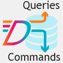

# Dapper.Cqrs



Packages provides ability to use [CQRS (Command Query Responsibility Segregation)](https://martinfowler.com/bliki/CQRS.html) pattern for database data reading (Queries) or its modification (Commands). It includes ambient connection and transaction handling, so after easy set-up, developers are only required to write Query and Command classes which usually are database SQL statements, wrapped in separate classes, with a little bit of parameter handling (business as usual).

Package uses [Dapper](https://stackexchange.github.io/Dapper/) - a simple object mapper for .Net built by StackOverflow developers and is one of the most performing ORMs in .Net landscape (if not fastest).

Project was influenced by another repository - [UPNXT-Dapper-cqrs](https://github.com/upnxt/upnxt-dapper-cqrs). Solution is separating concerns into Abstractions (no dependencies), Database-specific and Testing helpers to be used in more architecturally utilizable way with [practical developer usage ease](https://github.com/salixzs/Dapper.Cqrs/wiki/Productivity) and ability to [validate "magic string queries"](https://github.com/salixzs/Dapper.Cqrs/wiki/QueryTesting) against database to avoid runtime fails due to database structural changes not followed in code.

Repo containing actual usage [sample project](https://github.com/salixzs/Dapper.Cqrs/wiki/AspNet5ApiSample) and Visual Studio [item templates](https://github.com/salixzs/Dapper.Cqrs/wiki/Productivity#provided-templates) for most of development needs.

Approach is succesfully used in huge project (>3M code lines) and database of 200 tables with ~10TB of data.

Packages are targeting .Net Standard 2.0

| Package | NuGet | Build |  Code Coverage | Downloads |
| ------- | ----- | ----- | -------------- | --------- |
| Dapper.CQRS.Abstractions | [](https://www.nuget.org/packages/Salix.Dapper.Cqrs.Abstractions) |  | [](https://dev.azure.com/SmartDance/GitHubProjects/_build?definitionId=4) |  |
| Dapper.CQRS.MsSql | [](https://www.nuget.org/packages/Salix.Dapper.Cqrs.MsSql) |  | [](https://dev.azure.com/SmartDance/GitHubProjects/_build?definitionId=5) |  |
| Dapper.CQRS.Testing.MsSql.xUnit | [](https://www.nuget.org/packages/Salix.Dapper.Cqrs.MsSql.Testing.XUnit) |  | N/A |  |

> Detailed documentation is in [WIKI](https://github.com/salixzs/Dapper.Cqrs/wiki).

# Usage

When packages are added and set-up (see "[Setup](https://github.com/salixzs/Dapper.Cqrs/wiki/Setup)" in Wiki) - as application developer you need to do two things (besides writing tests).

* Create `IQuery` (Data retrieval) or `ICommand` (Data modification) implementation classes based on provided base classes.
* Inject `ICommandQueryContext` into your business logic class and use it to execute `IQuery` and `ICommand` classes against database engine. This is the only dependency required to work with database (Yeah, no more numerous repositories to depend upon!)

## IQuery
Required to be able to read data from database. Create new class and implement its interface (used provided base class to partially do that):
```csharp
public sealed class GetAllRecordsQuery : MsSqlQueryMultipleBase<SampleData>
{
    public override string SqlStatement => "SELECT * FROM SampleDataTable";
}
```


## ICommand
Similar to Query above, but dedicated to data modification statements.
```csharp
public sealed class SampleCreateCommand : MsSqlCommandBase<int>
{
    // Holds passed in object to be created as record in DB.
    private readonly SampleData _sampleObject;
    
    // Constructor, getting object to be saved
    public SampleCreateCommand(SampleData dbObject) =>
        _sampleObject = dbObject ?? throw new ArgumentNullException(nameof(dbObject), "No data passed");
    
    // Actual SQL statement to be executed.
    // Here appended statement to get last autoincrement value from DB == inserted record ID.
    public override string SqlStatement => @"
        INSERT INTO SampleTable (
            Name
        ) VALUES (
            @Name
        );SELECT CAST(SCOPE_IDENTITY() as int)";

    // Prepare object for Dapper to pass as parameters for SQL statement
    public override object Parameters => _sampleObject;
}
```

## Execution

Inject `ICommandQueryContext` into your business logic classes, which require to work with data in database.
```csharp
public class SampleLogic : ISampleLogic
{
    private readonly ICommandQueryContext _db;
    
    // Constructor - yes, inject just this one (no more numerous repositories!)
    public SampleLogic(ICommandQueryContext db) => _db = db;
}
```

Then in this class methods you can use this injected object and use its methods with prepared `IQuery` and `ICommand` classes to do database calls.

```csharp
// Reading data (CancellationToken in optional parameter - can be omitted = CancellationToken.None)
public async Task<IEnumerable<SampleData>> GetAll(int refId, CancellationToken token) => 
    await _db.QueryAsync(new SampleQuery(refId), token);

// Creating (saving) data (CancellationToken in optional parameter - can be omitted = CancellationToken.None)
public async Task<int> Create(SampleData dataObject, CancellationToken token) => 
    await _db.ExecuteAsync(new SampleCreateCommand(dataObject), token);
```

## Testability
As package uses interfaces for everything - it is easy to be mocked for isolation in pure unit-testing routines.

`Testing` package includes prepared base classes and helpers to automatically find all Queries and Commands in your project and validate SQL statements in those against database for syntax validity. There are helpers for other testing needs, like compare DTO with database object and write/read tests.

See Sample project testing project for reference to such tests.

> Read more detailed documentation in [WIKI](https://github.com/salixzs/Dapper.Cqrs/wiki).


### Like what I created?
<a href="https://www.buymeacoffee.com/salixzs" target="_blank"></a>